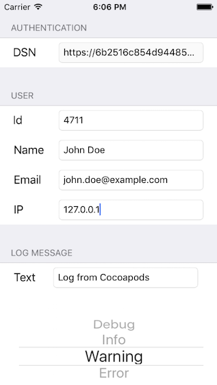

# MSSentryCocoaLumberjack

[](https://travis-ci.org/messeb/MSSentryCocoaLumberjack)
[](http://cocoapods.org/pods/MSSentryCocoaLumberjack)
[](http://cocoapods.org/pods/MSSentryCocoaLumberjack)
[](http://cocoapods.org/pods/MSSentryCocoaLumberjack)

MSSentryLogger is a custom logger for [CocoaLumberjack](https://github.com/CocoaLumberjack/CocoaLumberjack) that logs to [Sentry](https://www.getsentry.com/).

It contains a mapping from the CocoaLumberJack `DDLogFlag` to the `RavenLogEvent`. You can call the CocoaLumberjack logging function and it will produce a corresponding event in Sentry.

### Mapping

| CocoaLumberjack | Sentry |
|-----------------|--------|
| DDLogDebug      | Debug  |
| DDLogInfo       | Info   |
| DDLogWarn       | Warning|
| DDLogError      | Error  |

##Installation

Using [CocoaPods](http://www.cocoapods.org):

```ruby
pod "MSSentryCocoaLumberjack"
```


## Usage

You need a [Sentry](https://getsentry.com) account.

Import the pod and create a new `MSSentryLogger` instance with your credentials (DSN)

```
import MSSentryCocoaLumberjack

// ... 

let sentryLogger = MSSentryLogger(dsn: <YOUR DSN>)

```

Than add the new logger to the CocoaLumberjack loggers

```
DDLog.addLogger(sentryLogger)
```

Now you can call the CocoaLumberjack logging functions (`DDLogDebug`, `DDLogInfo`, `DDLogWarn`, `DDLogError`) and a Sentry log event will be created.

If you only want to see a certain level, such as errors, add with a level

```
DDLog.addLogger(sentryLogger, withLevel: .Error)
```

### Sentry properties

On the `MSSentryLogger` instance you can modify values for `user`, `tags` and `extra`. These are `[String: AnyObject]` dictionaries and the set values will be send in the next requests.

```
// user has predefined keys by Sentry
sentryLogger?.user = ["id": "4711", "username": "John Doe", "email": "john.doe@example.com", "ip_address": 
"127.0.0.1"]

sentryLogger?.tags = ["tag1": "value1", "tag2": "value2"]

sentryLogger?.extra = ["extra1": ""valueXYZ"]

```

You can always set new values to `user`, `tags` and `extra`. For more information take a look at the Sentry documentation: [https://docs.getsentry.com/hosted/learn/context/](https://docs.getsentry.com/hosted/learn/context/)

## Example

To run the example project, clone the repo, and run `pod install` from the Example directory first.

In the example app you can add your credentials and trigger logs to Sentry:



You will see the event instantly in your Sentry account

## Author

messeb

## License

MSSentryCocoaLumberjack is available under the MIT license. See the LICENSE file for more info.
